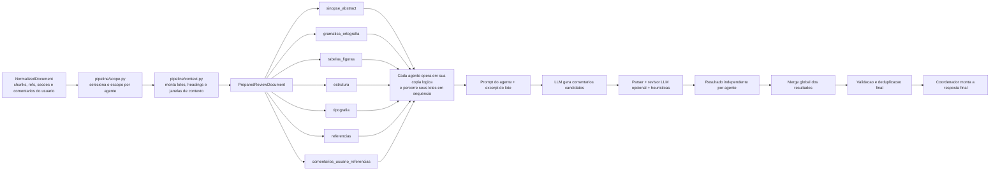
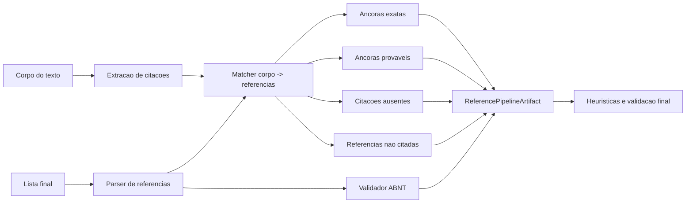

# lang_IPEA_editorial

Sistema de revisao editorial para `.docx`, `.pdf` e `normalized_document.json`, com execucao via CLI e interface web em Streamlit.

O projeto combina:
- extracao estruturada do documento;
- revisao por agentes especializados;
- heuristicas e validacao deterministica;
- consolidacao final dos comentarios;
- exportacao em DOCX comentado e JSON.

## Visao geral

O pipeline atual trabalha em quatro camadas:

1. `document_loader.py` carrega o arquivo de entrada e gera um `NormalizedDocument`.
2. `pipeline/scope.py` define quais trechos cada agente pode revisar.
3. `pipeline/context.py`, `pipeline/runtime.py` e `pipeline/orchestrator.py` executam a revisao lote a lote.
4. `pipeline/validation.py`, `pipeline/consolidation.py` e `pipeline/coordinator.py` limpam a saida e produzem a resposta final.

Os comentarios produzidos pelos agentes passam por filtros de seguranca e deduplicacao antes de aparecer na saida final.

## Agentes

Agentes editoriais atualmente ativos:

- `sinopse_abstract`
- `gramatica_ortografia`
- `tabelas_figuras`
- `estrutura`
- `tipografia`
- `referencias`
- `comentarios_usuario_referencias`

Organizacao do codigo:

- `src/editorial_docx/agents/heuristics/`: heuristicas por agente.
- `src/editorial_docx/agents/scopes/`: regras de escopo.
- `src/editorial_docx/agents/validation/`: regras de validacao.
- `src/editorial_docx/prompts/`: prompts e perfis.

## Comportamento atual importante

### Gramatica e ortografia

O agente de gramatica foi simplificado para operar, por padrao, em modo `TEXTO_INTEIRO`.

Isso significa que:

- o texto inteiro do escopo de gramatica vai em uma unica chamada por passagem;
- nao ha micro-lotes paralelos para esse agente;
- o agente foi ampliado para buscar nao so ortografia, pontuacao, concordancia e regencia, mas tambem microerros mecanicos de escrita, como espaco duplo, falta de espaco apos pontuacao e espaco indevido antes de pontuacao;
- heuristicas locais complementam a LLM para capturar erros objetivos recorrentes de concordancia e espacamento;
- o ponto central dessa configuracao fica em `src/editorial_docx/config.py`, via `GRAMMAR_CONTEXT_MODE`.

Arquivos principais desse fluxo:

- `src/editorial_docx/agents/heuristics/grammar.py`
- `src/editorial_docx/agents/validation/grammar.py`
- `src/editorial_docx/pipeline/context.py`
- `src/editorial_docx/pipeline/runtime.py`
- `src/editorial_docx/prompts/prompt.py`

### Referencias

O fluxo de referencias agora separa com mais clareza tres responsabilidades:

1. mapear citacoes no corpo do texto;
2. relacionar corpo e lista final de referencias;
3. validar a lista final segundo regras ABNT.

O artefato interno dessa etapa e `ReferencePipelineArtifact`, definido em:

- `src/editorial_docx/models.py`

Ele e construido em:

- `src/editorial_docx/references/analysis.py`

e depois reaproveitado por:

- `src/editorial_docx/agents/heuristics/references.py`
- `src/editorial_docx/pipeline/validation.py`

Hoje esse artefato agrega:

- citacoes do corpo;
- entradas da lista final;
- ancoras exatas;
- ancoras provaveis;
- citacoes sem correspondencia clara;
- referencias nao citadas no corpo;
- problemas ABNT por entrada.

## Estrutura do projeto

### Pastas principais

- `docs/`
  Documentacao complementar e notas de estado.
- `testes/`
  Suite de testes automatizados.

### Modulos principais

- `src/editorial_docx/config.py`
  Configuracoes globais do projeto.
- `src/editorial_docx/document_loader.py`
  Carregamento de DOCX, PDF e JSON normalizado.
- `src/editorial_docx/normalized_document.py`
  Modelo intermediario independente da origem do arquivo.
- `src/editorial_docx/graph_chat.py`
  Fachada principal usada pela aplicacao e pelos testes.
- `src/editorial_docx/pipeline/`
  Preparacao de contexto, execucao, validacao, consolidacao e coordenacao final.
- `src/editorial_docx/references/`
  Fachada da camada bibliografica.
- `src/editorial_docx/io/`
  Funcoes de IO e localizacao de comentarios.

### Camada ABNT

O projeto mantem a base bibliografica em dois niveis:

- modulos `abnt_*` em `src/editorial_docx/` com parser, matcher e validator;
- fachada em `src/editorial_docx/references/` para o uso interno do restante do pipeline.

## Fluxo do codigo


## Fluxo de atuacao dos agentes



Observacao: no fluxo principal atual, implementado em `src/editorial_docx/graph_chat.py`, os agentes operam de forma independente sobre a mesma preparacao do documento, com ate 3 agentes em paralelo, sem fallback automatico e com seed fixa. A memoria progressiva continua local a cada agente, lote a lote, e o merge acontece apenas depois que todos terminam.

## Fluxo de referencias



Observacao: aqui as ramificacoes representam produtos derivados do matcher e do validador, nao execucao paralela. A construcao de `ReferencePipelineArtifact` tambem ocorre de forma sequencial em `src/editorial_docx/references/analysis.py`.

## Instalacao

### Requisitos

- Python 3.10+
- Uma chave de API de LLM (OpenAI, Ollama ou provedor compatível)

### 1. Instalar dependencias

Com `uv` (recomendado):

```bash
uv sync --dev
```

Com `pip`:

```bash
python -m venv .venv
.venv\Scripts\activate
pip install -U pip
pip install -e .[dev]
```

### 2. Configurar chave da API

Copie o arquivo de exemplo e edite com seus dados:

```bash
copy .env.example .env
```

O sistema le as variaveis do `.env` na raiz. Configure conforme seu provedor:

**OpenAI** (mais comum):
```env
LLM_PROVIDER=openai
LLM_MODEL=gpt-5.2
LLM_API_KEY=sk-sua-chave-aqui
```

**Ollama** (local):
```env
LLM_PROVIDER=ollama
LLM_BASE_URL=http://localhost:11434/v1
LLM_MODEL=llama3.1:8b
LLM_API_KEY=ollama
```

**OpenAI-compatible** (servidor interno):
```env
LLM_PROVIDER=openai_compatible
LLM_BASE_URL=http://servidor-interno/v1
LLM_MODEL=nome-do-modelo
LLM_API_KEY=token-opcional
```

**IpeaGPT / IpeaIA**:
```env
LLM_PROVIDER=openai_compatible
LLM_BASE_URL=https://ipeagpt.ipea.gov.br/api/v1
LLM_MODEL=nome-do-modelo-listado-em-/models
LLM_API_KEY=token-se-houver
```

> A chave configurada serve tanto para a CLI quanto para a interface Streamlit. Nao é necessario configurar separadamente.

### 3. Executar

**CLI:**
```bash
uv run editorial-docx "D:\caminho\para\arquivo.docx"
```

**Interface Web (Streamlit):**
```bash
uv run streamlit run streamlit_app.py
```

## Execucao

### Streamlit

```bash
streamlit run streamlit_app.py
```

O app:

- permite subir arquivos pela interface;
- mostra progresso geral e progresso por agente durante a execucao;
- entrega DOCX e relatorios como downloads, sem gravar artefatos no projeto.

### CLI

```bash
python -m editorial_docx "D:\caminho\para\arquivo.docx"
```

Com `uv`, o comando equivalente fica:

```bash
uv run editorial-docx "D:\caminho\para\arquivo.docx"
```

Tambem aceita:

- `.pdf`
- `.json` com `normalized_document`

Argumentos principais:

- `--question`
- `--output-docx`
- `--output-json`
- `--output-normalized-json`

Comandos auxiliares:

- `uv run editorial-gold-dataset` — gerar scaffold do dataset ouro
- `uv run editorial-gold-metrics` — consolidar metricas do dataset ouro
- `uv run editorial-benchmark` — rodar benchmark entre modelos LLM

### AI Skill (OpenCode / Claude Code / Codex)

O projeto inclui uma skill para assistentes de IA que reconhece os três modos de acesso e executa o pipeline automaticamente. Instalação:

```powershell
# Escopo repo (apenas neste diretorio)
.\install.ps1 -Scope repo

# Escopo user (global, disponivel em qualquer projeto)
.\install.ps1 -Scope user
```

```bash
# Linux/macOS
bash install.sh repo
bash install.sh user
```

A skill é instalada nos paths:

| Path | Ferramenta |
|---|---|
| `.opencode/skills/` ou `~/.config/opencode/skills/` | OpenCode |
| `.claude/skills/` ou `~/.claude/skills/` | Claude Code |
| `.agents/skills/` ou `~/.agents/skills/` | OpenAI Codex |

A fonte canonica da skill esta em `.opencode/skills/revisao-editorial-ipea/SKILL.md`.

## Saidas

Saidas padrao da CLI, quando nenhum caminho de saida e informado:

- `<nome>_normalized_document.json`
- `<nome>_output_<modelo>.relatorio.json`
- `<nome>_output_<modelo>.relatorio.diagnostics.json`
- `<nome>_output_<modelo>.docx`

Com `--keep-history`, a CLI grava snapshots em uma pasta `historico/` ao lado do arquivo de saida principal.

O arquivo `diagnostics.json` resume rastros de execucao por agente e por lote, incluindo:

- falhas de conexao;
- contagem de comentarios do LLM;
- comentarios aceitos por heuristica;
- status de cada lote.
- decisao de verificacao por comentario;
- motivo de aceite ou rejeicao (`VerificationDecision.reason`);
- origem da decisao (`llm` ou `heuristic`);
- comentario serializado, com trecho, sugestao e batch de origem.

## Configuracao

As constantes centrais ficam em:

- `src/editorial_docx/config.py`

Exemplos de configuracao:

- modelo padrao;
- timeout;
- retries;
- limites de batch;
- modo de contexto do agente de gramatica.

Comportamento atual fixo do runtime:

- execucao deterministica sempre ativa;
- seed fixa por padrao;
- sem fallback automatico entre providers/modelos;
- ate 3 agentes executados em paralelo no fluxo principal.

As credenciais e provedores sao lidos do `.env`.
Use como regra principal:

```env
LLM_PROVIDER=<openai|openai_compatible|ollama>
LLM_MODEL=<nome-do-modelo>
LLM_BASE_URL=<opcional para openai, obrigatorio para openai_compatible e ollama>
LLM_API_KEY=<obrigatorio para openai, opcional para ollama local>
```

As variaveis legadas `OPENAI_*` e `OLLAMA_*` continuam aceitas como fallback de compatibilidade, mas `LLM_*` passou a ser a nomenclatura preferencial.

### Exemplo OpenAI

```env
LLM_PROVIDER=openai
LLM_MODEL=gpt-5.2
LLM_API_KEY=sk-...
```

### Exemplo Ollama

```env
LLM_PROVIDER=ollama
LLM_BASE_URL=http://localhost:11434/v1
LLM_MODEL=llama3.1:8b
LLM_API_KEY=ollama
```

### Exemplo OpenAI-compatible

```env
LLM_PROVIDER=openai_compatible
LLM_BASE_URL=http://servidor-interno/v1
LLM_MODEL=nome-do-modelo
LLM_API_KEY=token-opcional
```

### Exemplo IpeaGPT / IpeaIA

```env
LLM_PROVIDER=openai_compatible
LLM_BASE_URL=https://ipeagpt.ipea.gov.br/api/v1
LLM_MODEL=nome-do-modelo-listado-em-/models
LLM_API_KEY=token-se-houver
```

Para verificar os modelos disponiveis no provider configurado:

```bash
uv run python scripts/editorial_lab.py preflight
```

Na interface Streamlit, a sidebar da LLM agora tambem tem o botao `Listar modelos disponiveis`.

## Testes

Rodada principal:

```bash
pytest testes/test_llm.py testes/test_architecture_modular.py testes/test_graph_chat.py -q
```

Rodada focada no pipeline atual de gramatica e referencias:

```bash
pytest testes/test_architecture_modular.py testes/test_graph_chat.py -q
```

Validacao de import e sintaxe:

```bash
python -m compileall src/editorial_docx streamlit_app.py
```

## Observacoes

- `src/editorial_docx/review_heuristics.py` continua existindo como fachada de compatibilidade para imports antigos.
- A interface publica principal do pacote esta em `src/editorial_docx/graph_chat.py`.
- O estado editorial consolidado tambem esta documentado em `docs/ESTADO_ATUAL_EDITORIAL.md`.
