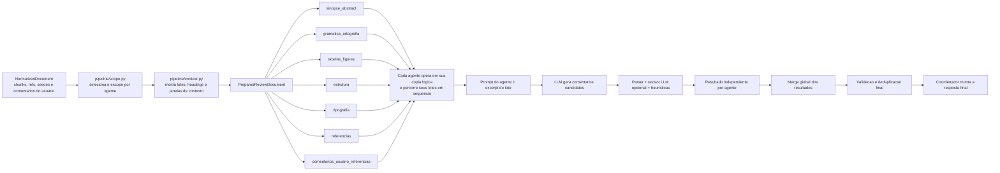
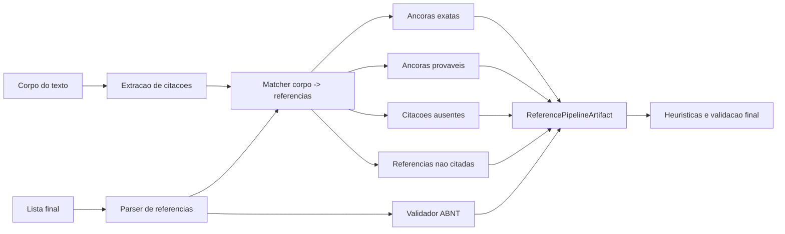
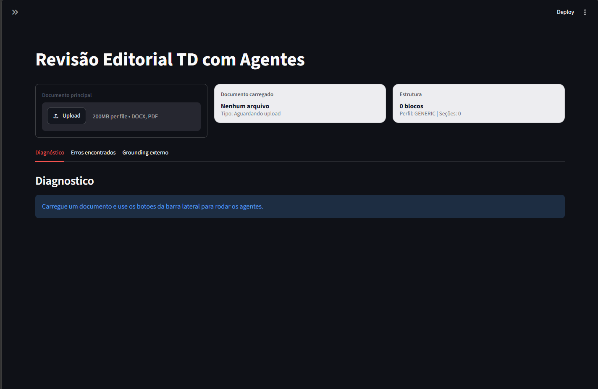
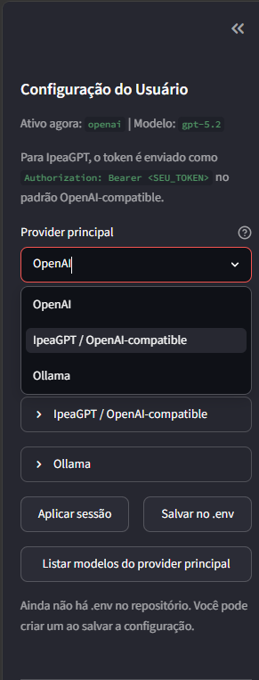
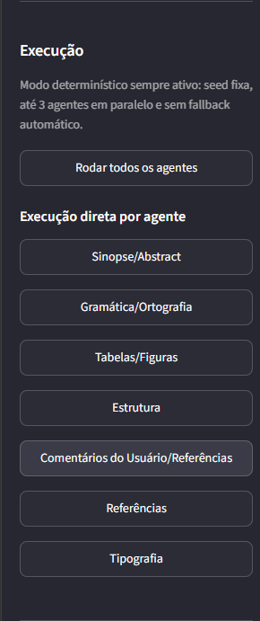
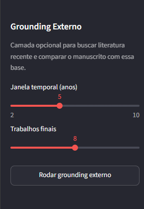
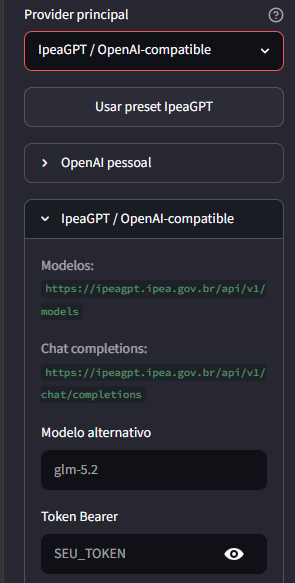

# lang_IPEA_editorial

Sistema de revisao editorial para `.docx`, `.pdf` e `normalized_document.json`, com execucao via CLI e interface web em Streamlit.

O projeto combina:
- extracao estruturada do documento;
- revisao por agentes especializados;
- heuristicas e validacao deterministica;
- consolidacao final dos comentarios;
- exportacao em DOCX comentado e JSON.

## Visao geral

O pipeline atual trabalha em quatro camadas:

1. `document_loader.py` carrega o arquivo de entrada e gera um `NormalizedDocument`.
2. `pipeline/scope.py` define quais trechos cada agente pode revisar.
3. `pipeline/context.py`, `pipeline/runtime.py` e `pipeline/orchestrator.py` executam a revisao lote a lote.
4. `pipeline/validation.py`, `pipeline/consolidation.py` e `pipeline/coordinator.py` limpam a saida e produzem a resposta final.

Os comentarios produzidos pelos agentes passam por filtros de seguranca e deduplicacao antes de aparecer na saida final.

## Agentes

Agentes editoriais da execução padrão:

- `sinopse_abstract`
- `gramatica_ortografia`
- `tabelas_figuras`
- `estrutura`
- `tipografia`
- `referencias`
- `comentarios_usuario_referencias`

O agente `coerencia_logica` está disponível como experimental e opt-in, enquanto é calibrado com uma base adjudicada.

Organizacao do codigo:

- `src/editorial_docx/agents/heuristics/`: heuristicas por agente.
- `src/editorial_docx/agents/scopes/`: regras de escopo.
- `src/editorial_docx/agents/validation/`: regras de validacao.
- `src/editorial_docx/prompts/`: prompts e perfis.

## Comportamento atual importante

### Gramatica e ortografia

O agente de gramatica foi simplificado para operar, por padrao, em modo `TEXTO_INTEIRO`.

Isso significa que:

- o texto inteiro do escopo de gramatica vai em uma unica chamada por passagem;
- nao ha micro-lotes paralelos para esse agente;
- o agente foi ampliado para buscar nao so ortografia, pontuacao, concordancia e regencia, mas tambem microerros mecanicos de escrita, como espaco duplo, falta de espaco apos pontuacao e espaco indevido antes de pontuacao;
- heuristicas locais complementam a LLM para capturar erros objetivos recorrentes de concordancia e espacamento;
- o ponto central dessa configuracao fica em `src/editorial_docx/config.py`, via `GRAMMAR_CONTEXT_MODE`.

Arquivos principais desse fluxo:

- `src/editorial_docx/agents/heuristics/grammar.py`
- `src/editorial_docx/agents/validation/grammar.py`
- `src/editorial_docx/pipeline/context.py`
- `src/editorial_docx/pipeline/runtime.py`
- `src/editorial_docx/prompts/prompt.py`

### Referencias

O fluxo de referencias agora separa com mais clareza tres responsabilidades:

1. mapear citacoes no corpo do texto;
2. relacionar corpo e lista final de referencias;
3. validar a lista final segundo regras ABNT.

O artefato interno dessa etapa e `ReferencePipelineArtifact`, definido em:

- `src/editorial_docx/models.py`

Ele e construido em:

- `src/editorial_docx/references/analysis.py`

e depois reaproveitado por:

- `src/editorial_docx/agents/heuristics/references.py`
- `src/editorial_docx/pipeline/validation.py`

Hoje esse artefato agrega:

- citacoes do corpo;
- entradas da lista final;
- ancoras exatas;
- ancoras provaveis;
- citacoes sem correspondencia clara;
- referencias nao citadas no corpo;
- problemas ABNT por entrada.

## Estrutura do projeto

### Pastas principais

- `docs/`
  Documentacao complementar e notas de estado.
- `testes/`
  Suite de testes automatizados.

### Modulos principais

- `src/editorial_docx/config.py`
  Configuracoes globais do projeto.
- `src/editorial_docx/document_loader.py`
  Carregamento de DOCX, PDF e JSON normalizado.
- `src/editorial_docx/normalized_document.py`
  Modelo intermediario independente da origem do arquivo.
- `src/editorial_docx/graph_chat.py`
  Fachada principal usada pela aplicacao e pelos testes.
- `src/editorial_docx/pipeline/`
  Preparacao de contexto, execucao, validacao, consolidacao e coordenacao final.
- `src/editorial_docx/references/`
  Fachada da camada bibliografica.
- `src/editorial_docx/io/`
  Funcoes de IO e localizacao de comentarios.

### Camada ABNT

O projeto mantem a base bibliografica em dois niveis:

- modulos `abnt_*` em `src/editorial_docx/` com parser, matcher e validator;
- fachada em `src/editorial_docx/references/` para o uso interno do restante do pipeline.

## Fluxo do codigo


```mermaid
flowchart LR
    A["Usuario envia DOCX, PDF ou normalized JSON"] --> B["document_loader.py"]
    B --> C["normalized_document.py<br/>gera blocos, secoes, TOC e comentarios do usuario"]
    C --> D["pipeline/scope.py<br/>seleciona o escopo por agente"]
    D --> E["pipeline/context.py<br/>monta lotes e contexto"]
    E --> F["pipeline/orchestrator.py / graph_chat.py"]
    F --> G["prompts + LLM + heuristicas"]
    G --> H["pipeline/validation.py"]
    H --> I["pipeline/consolidation.py"]
    I --> J["pipeline/coordinator.py"]
    J --> K["CLI / Streamlit / docx_utils.py"]
```

## Fluxo de atuacao dos agentes


```mermaid
flowchart LR
    A["NormalizedDocument<br/>chunks, refs, secoes e comentarios do usuario"] --> B["pipeline/scope.py<br/>seleciona o escopo por agente"]
    B --> C["pipeline/context.py<br/>monta lotes, headings e janelas de contexto"]
    C --> D["PreparedReviewDocument"]
    D --> E1["sinopse_abstract"]
    D --> E2["gramatica_ortografia"]
    D --> E3["tabelas_figuras"]
    D --> E4["estrutura"]
    D --> E5["tipografia"]
    D --> E6["referencias"]
    D --> E7["comentarios_usuario_referencias"]
    E1 --> F["Cada agente opera em sua copia logica<br/>e percorre seus lotes em sequencia"]
    E2 --> F
    E3 --> F
    E4 --> F
    E5 --> F
    E6 --> F
    E7 --> F
    F --> G["Prompt do agente + excerpt do lote"]
    G --> H["LLM gera comentarios candidatos"]
    H --> I["Parser + revisor LLM opcional + heuristicas"]
    I --> J["Resultado independente por agente"]
    J --> K["Merge global dos resultados"]
    K --> L["Validacao e deduplicacao final"]
    L --> M["Coordenador monta a resposta final"]
```

Observacao: no fluxo principal atual, implementado em `src/editorial_docx/graph_chat.py`, os agentes operam de forma independente sobre a mesma preparacao do documento, com ate 3 agentes em paralelo, sem fallback automatico e com seed fixa. A memoria progressiva continua local a cada agente, lote a lote, e o merge acontece apenas depois que todos terminam.

## Fluxo de referencias


```mermaid
flowchart LR
    A["Corpo do texto"] --> B["Extracao de citacoes"]
    C["Lista final"] --> D["Parser de referencias"]
    B --> E["Matcher corpo -> referencias"]
    D --> E
    E --> F["Ancoras exatas"]
    E --> G["Ancoras provaveis"]
    E --> H["Citacoes ausentes"]
    E --> I["Referencias nao citadas"]
    D --> J["Validador ABNT"]
    F --> K["ReferencePipelineArtifact"]
    G --> K
    H --> K
    I --> K
    J --> K
    K --> L["Heuristicas e validacao final"]
```

Observacao: aqui as ramificacoes representam produtos derivados do matcher e do validador, nao execucao paralela. A construcao de `ReferencePipelineArtifact` tambem ocorre de forma sequencial em `src/editorial_docx/references/analysis.py`.

## Instalacao

## Execução em contêiner e deploy

O projeto já está organizado para ser enviado diretamente ao projeto GitLab `ipearev/streamlit`:

```text
.
├── .gitlab-ci.yml       # testes, build Kaniko e deploy
├── Dockerfile           # imagem Streamlit de produção
├── deployment.yaml      # Deployment Kubernetes (template)
├── service.yaml         # Service Kubernetes
├── ingress.yaml         # Ingress HTTPS (template)
├── src/                 # núcleo do pipeline editorial
├── paginas/             # telas auxiliares da interface Streamlit
├── streamlit_app.py     # aplicação web
└── deploy/              # exemplos de Secret e autorização do agente
```

O projeto inclui uma imagem Docker reprodutível e manifestos Kubernetes na raiz.
Eles isolam a aplicação da raiz de desenvolvimento e mantêm chaves fora da imagem e do repositório.

Para testar localmente com Docker Desktop, copie `.env.docker.example` para `.env.docker`,
preencha somente as variáveis do provedor escolhido e execute:

```powershell
docker compose --env-file .env.docker up --build
```

Abra `http://localhost:8501`. O contêiner é executado sem privilégios e com o sistema de
arquivos somente leitura; documentos carregados e saídas da interface permanecem temporários.
Por isso, em contêiner, a opção **Salvar** credenciais fica desativada; use variáveis de
ambiente/Secrets do ambiente ou a opção **Usar nesta sessão**.

Para Kubernetes, `deployment.yaml` e `ingress.yaml` são templates. A pipeline GitLab substitui
`__IMAGE__` e `__INGRESS_HOST__`; os nomes dos secrets usados na implantação são fixos para o
IPEAREV: `ipearev-runtime`, `registry-gitlab-ipearev` e `ipea-star-certificate`. Crie o secret
de runtime no namespace `ipearev`, sem versioná-lo, por exemplo:

```powershell
kubectl -n ipearev create secret generic ipearev-runtime `
  --from-env-file=.env.docker
kubectl -n ipearev apply -f deployment.yaml `
  -f service.yaml `
  -f ingress.yaml
```

`deploy/secret.example.yaml` documenta o formato do Secret, mas não deve receber
valores reais. Antes do deploy, escolha os limites de CPU/memória e a quantidade de réplicas
de acordo com o tamanho esperado dos documentos e a concorrência do provedor LLM.

### CI/CD GitLab

> **Configuração própria do IPEAREV.** Para o projeto `ipearev/streamlit`, o agente é
> `ipearev/k8s-agents`, o contexto é `ipearev/k8s-agents:ipearev`, o namespace é
> `ipearev` e o endereço é `https://ipearev.ipea.gov.br`. Os secrets esperados no
> namespace são `ipearev-runtime`, `registry-gitlab-ipearev` e `ipea-star-certificate`.
>
> Não crie `KUBE_CONTEXT`, `K8S_NAMESPACE`, `K8S_INGRESS_HOST`, `K8S_TLS_SECRET` ou
> `K8S_IMAGE_PULL_SECRET` no projeto. A pipeline usa os valores acima diretamente.
> É obrigatório adicionar `- id: ipearev/streamlit` ao `ci_access.projects` do agente
> no repositório `ipearev/k8s-agents`.

O arquivo `.gitlab-ci.yml` testa, gera a imagem com Kaniko, publica no Registry do próprio
projeto e implanta os templates pelo agente Kubernetes configurado acima.

O destino definido para este projeto é **`ipearev/streamlit`**. Portanto, envie o
repositório com esse caminho no GitLab antes de ativar o pipeline.

O namespace deve conter o Secret `ipearev-runtime`, com a configuração do provedor LLM. A
autorização do agente Kubernetes é mantida no projeto separado `ipearev/k8s-agents` e deve
incluir:

```yaml
ci_access:
  projects:
    - id: ipearev/streamlit
```

Não são necessárias variáveis de infraestrutura no projeto GitLab.

### Roteiro completo de publicação e subida

1. **Validar o código antes de publicar**

   ```powershell
   uv sync --frozen --dev
   uv run pytest -q
   uv run python -m compileall streamlit_app.py paginas src/editorial_docx
   ```

2. **Testar a imagem localmente**

   Copie `.env.docker.example` para `.env.docker`, preencha apenas as credenciais do provedor
   escolhido e execute:

   ```powershell
   docker compose --env-file .env.docker up --build
   ```

   Confirme em `http://localhost:8501` que o upload, a seleção de modelo e o download do resultado
   funcionam. Não versione `.env.docker`, `.env`, documentos de teste ou resultados de revisão.

3. **Preparar o namespace Kubernetes**

   Crie uma vez o secret de execução, a partir do arquivo local de ambiente:

   ```powershell
   kubectl -n ipearev create secret generic ipearev-runtime `
     --from-env-file=.env.docker
   ```

   No namespace `ipearev`, crie ou clone os secrets `registry-gitlab-ipearev` e
   `ipea-star-certificate`; autorize também o projeto `ipearev/streamlit` no agente do
   repositório `ipearev/k8s-agents`.

4. **Configurar CI/CD no GitLab**

   Não cadastre variáveis de infraestrutura no projeto. A pipeline usa o contexto, namespace,
   host e secrets definidos acima; ela valida a presença dos secrets antes de aplicar o deploy.

5. **Publicar**

   Envie para a branch monitorada pelo GitLab. A pipeline só prossegue para deploy se os testes e
   a construção da imagem concluírem com sucesso. Após o rollout, valide:

   ```powershell
   kubectl -n ipearev rollout status deployment/ipearev --timeout=5m
   kubectl -n ipearev get pods,service,ingress
   ```

6. **Rollback**

   Para retornar à revisão anterior da aplicação:

   ```powershell
   kubectl -n ipearev rollout undo deployment/ipearev
   kubectl -n ipearev rollout status deployment/ipearev --timeout=5m
   ```

   Para retirar temporariamente a aplicação, use o job manual `stop_app` da pipeline GitLab.
   Ele remove somente Deployment, Service e Ingress; os Secrets e imagens permanecem preservados.

### Requisitos

- Python 3.10+
- Uma chave de API de LLM (OpenAI, Ollama ou provedor compatível)

### 1. Instalar dependencias

Com `uv` (recomendado):

```bash
uv sync --dev
```

Com `pip`:

```bash
python -m venv .venv
.venv\Scripts\activate
pip install -U pip
pip install -e .[dev]
```

### 2. Configurar chave da API

Copie o arquivo de exemplo e edite com seus dados:

```bash
copy .env.example .env
```

O sistema le as variaveis do `.env` na raiz. Configure conforme seu provedor:

**OpenAI** (mais comum):
```env
LLM_PROVIDER=openai
LLM_MODEL=gpt-5.2
LLM_API_KEY=sk-sua-chave-aqui
```

**Ollama** (local):
```env
LLM_PROVIDER=ollama
LLM_BASE_URL=http://localhost:11434/v1
LLM_MODEL=llama3.1:8b
LLM_API_KEY=ollama
```

**OpenAI-compatible** (servidor interno):
```env
LLM_PROVIDER=openai_compatible
LLM_BASE_URL=http://servidor-interno/v1
LLM_MODEL=nome-do-modelo
LLM_API_KEY=token-opcional
```

**IpeaGPT / IpeaIA**:
```env
LLM_PROVIDER=openai_compatible
LLM_BASE_URL=https://ipeagpt.ipea.gov.br/api/v1
LLM_MODEL=nome-do-modelo-listado-em-/models
LLM_API_KEY=token-se-houver
```

> A chave configurada serve tanto para a CLI quanto para a interface Streamlit. Nao é necessario configurar separadamente.

### 3. Executar

**CLI:**
```bash
uv run editorial-docx "D:\caminho\para\arquivo.docx"
```

**Interface Web (Streamlit):**
```bash
uv run streamlit run streamlit_app.py
```

## Execucao

### Streamlit

```bash
streamlit run streamlit_app.py
```

O app:

- permite subir arquivos pela interface;
- mostra progresso geral e progresso por agente durante a execucao;
- entrega DOCX e relatorios como downloads, sem gravar artefatos no projeto.

#### Interface do app

**Visao geral**

Tela inicial da aplicacao. Ela concentra o upload do documento principal, o resumo estrutural do arquivo carregado e as abas de navegacao entre diagnostico, erros encontrados e grounding externo.



**Configuracao do usuario**

Painel lateral para definir o provider principal da sessao, o modelo em uso e a forma de persistencia da configuracao. A interface permite aplicar a mudanca apenas na sessao atual, salvar no `.env` e listar os modelos disponiveis no provider selecionado.



**Execucao dos agentes**

Bloco de controle da revisao. Ele permite rodar todos os agentes em sequencia coordenada ou acionar individualmente cada especialidade editorial, como sinopse, gramatica, tabelas, estrutura, referencias e tipografia.



**Grounding externo**

Secao opcional para busca de literatura recente e comparacao do manuscrito com trabalhos relacionados. Os controles ajustam a janela temporal e a quantidade de resultados finais antes de iniciar a busca.



**Preset IpeaGPT / OpenAI-compatible**

Configuracao detalhada para ambientes compativeis com a API da OpenAI, incluindo o preset do IpeaGPT, os endpoints de `models` e `chat/completions`, um modelo alternativo e o token bearer enviado no cabecalho `Authorization`.



### CLI

```bash
python -m editorial_docx "D:\caminho\para\arquivo.docx"
```

Com `uv`, o comando equivalente fica:

```bash
uv run editorial-docx "D:\caminho\para\arquivo.docx"
```

Tambem aceita:

- `.pdf`
- `.json` com `normalized_document`

Argumentos principais:

- `--question`
- `--output-docx`
- `--output-json`
- `--output-normalized-json`

Comandos auxiliares:

- `uv run editorial-gold-dataset` — gerar scaffold do dataset ouro
- `uv run editorial-gold-metrics` — consolidar metricas do dataset ouro
- `uv run editorial-benchmark` — rodar benchmark entre modelos LLM

### AI Skill (OpenCode / Claude Code / Codex)

O projeto inclui uma skill para assistentes de IA que reconhece os três modos de acesso e executa o pipeline automaticamente.

A fonte canônica é `.agents/skills/revisao-editorial-ipea/SKILL.md`. Os arquivos em `.claude/` e `.opencode/` são espelhos para descoberta automática nesses assistentes e devem permanecer idênticos à fonte canônica.

Para usar a skill somente neste clone, não é necessário instalar nada: o Codex a descobre em `.agents/skills/`.

Para instalar globalmente a partir de um clone do repositório:

```powershell
# Escopo repo (apenas neste diretorio)
.\install.ps1 -Scope repo

# Escopo user (global, disponível em qualquer projeto e agente)
.\install.ps1 -Scope user
```

```bash
# Linux/macOS
bash install.sh repo
bash install.sh user
```

Para instalar somente a skill global do Codex direto do GitHub, sem depender de um caminho local:

```powershell
python C:\Users\<usuario>\.codex\skills\.system\skill-installer\scripts\install-skill-from-github.py `
  --repo 0rakul0/IPEA_editorial `
  --path .agents/skills/revisao-editorial-ipea
```

A instalação por `install.ps1`/`install.sh` usa os paths:

| Path | Ferramenta |
|---|---|
| `.agents/skills/` (no repositório) ou `~/.codex/skills/` (global) | OpenAI Codex |
| `.opencode/skills/` ou `~/.config/opencode/skills/` | OpenCode |
| `.claude/skills/` ou `~/.claude/skills/` | Claude Code |

Abra uma nova tarefa depois da instalação global para que o Codex recarregue a lista de skills. A instalação global disponibiliza as instruções; para executar o pipeline, a tarefa ainda deve estar neste repositório (ou em outro ambiente com o pacote instalado).

## Saidas

Saidas padrao da CLI, quando nenhum caminho de saida e informado:

- `<nome>_normalized_document.json`
- `<nome>_output_<modelo>.relatorio.json`
- `<nome>_output_<modelo>.relatorio.diagnostics.json`
- `<nome>_output_<modelo>.docx`

Com `--keep-history`, a CLI grava snapshots em uma pasta `historico/` ao lado do arquivo de saida principal.

O arquivo `diagnostics.json` resume rastros de execucao por agente e por lote, incluindo:

- falhas de conexao;
- contagem de comentarios do LLM;
- comentarios aceitos por heuristica;
- status de cada lote.
- decisao de verificacao por comentario;
- motivo de aceite ou rejeicao (`VerificationDecision.reason`);
- origem da decisao (`llm` ou `heuristic`);
- comentario serializado, com trecho, sugestao e batch de origem.

## Configuracao

As constantes centrais ficam em:

- `src/editorial_docx/config.py`

Exemplos de configuracao:

- modelo padrao;
- timeout;
- retries;
- limites de batch;
- modo de contexto do agente de gramatica.

Comportamento atual fixo do runtime:

- execucao deterministica sempre ativa;
- seed fixa por padrao;
- sem fallback automatico entre providers/modelos;
- ate 3 agentes executados em paralelo no fluxo principal.

As credenciais e provedores sao lidos do `.env`.
Use como regra principal:

```env
LLM_PROVIDER=<openai|openai_compatible|ollama>
LLM_MODEL=<nome-do-modelo>
LLM_BASE_URL=<opcional para openai, obrigatorio para openai_compatible e ollama>
LLM_API_KEY=<obrigatorio para openai, opcional para ollama local>
```

As variaveis legadas `OPENAI_*` e `OLLAMA_*` continuam aceitas como fallback de compatibilidade, mas `LLM_*` passou a ser a nomenclatura preferencial.

### Exemplo OpenAI

```env
LLM_PROVIDER=openai
LLM_MODEL=gpt-5.2
LLM_API_KEY=sk-...
```

### Exemplo Ollama

```env
LLM_PROVIDER=ollama
LLM_BASE_URL=http://localhost:11434/v1
LLM_MODEL=llama3.1:8b
LLM_API_KEY=ollama
```

### Exemplo OpenAI-compatible

```env
LLM_PROVIDER=openai_compatible
LLM_BASE_URL=http://servidor-interno/v1
LLM_MODEL=nome-do-modelo
LLM_API_KEY=token-opcional
```

### Exemplo IpeaGPT / IpeaIA

```env
LLM_PROVIDER=openai_compatible
LLM_BASE_URL=https://ipeagpt.ipea.gov.br/api/v1
LLM_MODEL=nome-do-modelo-listado-em-/models
LLM_API_KEY=token-se-houver
```

Para verificar os modelos disponiveis no provider configurado:

```bash
uv run python scripts/editorial_lab.py preflight
```

Na interface Streamlit, é possível escolher OpenAI, IpeaGPT ou Ollama local. No IpeaGPT, o usuário informa somente o Token Bearer e seleciona um modelo disponibilizado pelo serviço; o endpoint é definido pela configuração técnica do projeto.

## Calibragem da skill e melhoria dos prompts

A skill não retreina automaticamente o modelo de linguagem. Neste projeto, “aprender” significa extrair evidências das revisões humanas, transformá-las em ajustes verificáveis de prompts, escopos, heurísticas e validações, e medir o efeito em documentos que não participaram da calibragem.

O inventário atual dos documentos reservados está em [CONJUNTO_TESTE_HOLDOUT.md](docs/CONJUNTO_TESTE_HOLDOUT.md). Há nove candidatos executáveis para avaliação qualitativa, além de dois itens sem `original.docx`, que ainda não podem ser processados pelo pipeline.

### 1. Preparar um caso de aprendizado

Cada pasta precisa conter, no mínimo:

- `<nome> (original).docx`;
- `<nome> (para diagramar).docx` ou `<nome> (sem marcas).docx`.

Arquivos `(com marcas).docx` e o PDF final são opcionais, mas fortalecem a evidência sobre as correções humanas e sua confirmação na versão publicada.

### 2. Extrair padrões de uma pasta

```powershell
uv run python scripts/editorial_lab.py learn `
  "<pasta-editorial>" `
  --out-dir ".tmp/aprendizado/<nome-do-caso>"
```

O comando gera `editorial_knowledge.json` e `editorial_knowledge.md`. Priorize exemplos com estado `confirmed_final`: eles representam alterações humanas confirmadas na versão final. Casos `observed_change` servem como indício; `unresolved_or_not_applied` não deve virar regra sem revisão humana.

Para processar várias pastas elegíveis de uma única raiz:

```powershell
uv run python scripts/editorial_lab.py batch-learn `
  "<pasta-raiz>" `
  --out-dir ".tmp/aprendizado/lote" `
  --workers 4
```

### 3. Converter evidência em melhoria do sistema

Classifique o padrão antes de alterar o código:

| Tipo de melhoria | Onde alterar |
|---|---|
| Instrução editorial ou formato da resposta | `src/editorial_docx/prompts/` |
| Trecho que cada agente pode analisar | `src/editorial_docx/agents/scopes/` |
| Regra objetiva e repetível | `src/editorial_docx/agents/heuristics/` |
| Filtro contra falso positivo | `src/editorial_docx/agents/validation/` |
| Ordem, deduplicação ou apresentação final | `src/editorial_docx/pipeline/` |

Faça uma alteração pequena por vez. Todo novo prompt deve dizer: o que verificar, quando não comentar, como ancorar o trecho e como formular a correção. Não transforme preferência estilística, hipótese bibliográfica ou reescrita autoral em regra automática.

### 4. Avaliar sem contaminar o aprendizado

Rode o agente em um documento que não foi usado para calibragem e compare o relatório gerado com o conhecimento extraído:

```powershell
uv run python scripts/editorial_lab.py evaluate `
  --knowledge ".tmp/aprendizado/<nome-do-caso>/editorial_knowledge.json" `
  --report "<relatorio-agentes>.json" `
  --out-dir ".tmp/avaliacao/<nome-do-caso>"
```

Revise os falsos positivos e as mudanças humanas não cobertas. Só incorpore um novo padrão ao prompt ou à heurística quando ele for recorrente, específico e editorialmente justificável. Em seguida, acrescente um teste de regressão e rode a suíte abaixo.

## Testes

Rodada principal:

```bash
pytest testes/test_llm.py testes/test_architecture_modular.py testes/test_graph_chat.py -q
```

Rodada focada no pipeline atual de gramatica e referencias:

```bash
pytest testes/test_architecture_modular.py testes/test_graph_chat.py -q
```

Validacao de import e sintaxe:

```bash
python -m compileall src/editorial_docx streamlit_app.py
```

## Observacoes

- `src/editorial_docx/review_heuristics.py` continua existindo como fachada de compatibilidade para imports antigos.
- A interface publica principal do pacote esta em `src/editorial_docx/graph_chat.py`.
- O estado editorial consolidado tambem esta documentado em `docs/ESTADO_ATUAL_EDITORIAL.md`.
